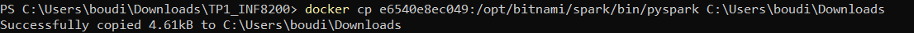

# Travail pratique 1: Création d'un cluster Spark sur Kubernetes pour réaliser un ETL de base

## Auteur

* [BOUDIAB Tinhinane](<a href="mailto:boudiab.tinhinane@courrier.uqam.ca">**`BOUT79360000`**</a>)

## Objectif

* Le but de Tp est d'utiliser le cluster spark sur kubernetes pour réaliser un script ETL de base.

## Environnement de travail

Le tp est realisé sur Windows 11, en utilisant l'invité de commande `PowerShell`.

## Description de la donnée

La source de donnée est simulée à partir d'une fonction `read_data_source`. Cette fonction retourne un DataFrame des dépenses d'usagers d'un service infonuagique.

## Taches à réaliser

1. L'ajout d'un worker au cluster spark sur kubernetes.
2. Réparer pyspark-shell.
3. Soumission d'un `spark-submit` afin de :
   1. Créer un DataFrame de dépenses.
   2. Mettre les données dans une table SQL `Temporary view`.
   3. Interroger la table avec des requêtes SQL.
4. Reduire le cluster à sa taille initiale.

## Tache 1

Cette tache vise à ajouter un worker dans le cluster spark. Pour y parvenir:

* On télécharge d'abord le fichier `values.yaml` qui se trouve sur le lien `https://raw.githubusercontent.com/bitnami/charts/main/bitnami/spark/values.yaml`.
* Ensuite, on démarre le cluster et on fait le mapping des ports à l'aide de la commande suivante: `helm install -f values-spark-3.5.0.yaml spark-release oci://registry-1.docker.io/bitnamicharts/spark`.
* À l'aide de la commande `kubectl get pods`, on affiche les pods lancés.

```
# Affichage des pods de cluster spark sur kubernetes
kubectl get pods
```

Le résultat de cette commande sont illustrée sur la figure suivante:


==>On constate que par defaut, on a 03 noeuds: un master et deux workers.

* Pour ajouter un worker, on execute la commande suivante sur PowerShell:
  `helm upgrade --set worker.replicaCount=3 spark-release oci://registry-1.docker.io/bitnamicharts/spark`
* On affiche les pods lancés, à l'aide de la commande précedente `kubctl get pods` pour verifier si un autre worker est ajouté.

La figure suivante illustre le résultat.


## Tache 2

La tache 2 vise à réparer pyspark-shell.

1. La première étape consiste à se connecter à spark master et de démarrer une session pyspark shell. La figure ci-dessous illustre l'erreur rencontrée lors de l'exécution de la commande pyspark:
   
2. Pour résoudre cette erreur, on envisage comme suivant:

   1. On cible le `fichier Bash` qui permet de démarrer la session Pyspark dans le dossier `.opt/bitnami/spark/bin`. puis on le copie dans le répertoire principal afin de le modifier. La figure suivante illustre la commande utilisée:
      
   2. Ensuite, on renomme le fichier `pyspark` dans le dossier `.opt/bitnami/spark/bin` par `pyspark.old` par la commande suivante:
      
   3. Aprés la modification du contenu de fichier pyspark, on le recopie dans le répertoire `.opt/bitnami/spark/bin` avec la commande suivante:
      
   4. Pour vérifier le changement effectué à notre nouveau fichier bash `pyspark`, on execute la commande suivante:

      ```
      diff --color ./pyspark.old ./pyspark 
      ```

      Le changement est illustré sur la figure suivante:
      
3. Aprés avoir suivre toutes ces étapes, on pourra par la suite lancer notre conteneur et demarrer notre session pyspark, en executant les commandes suivantes:

   ```python
   # La connexion au noeud master
   docker exec -it  dfa943ffa2ff bash
   # Lancement de la session pyspark et execution de fichier pi.py pour l'essayer seulement
   ./pyspark --master spark://spark-release-master-0.spark-release-headless.default.svc.cluster.local:7077 --name spark-pi local:///opt/bitnami/spark/examples/src/main/python/pi.py 10
   ```

## Tache 3

Le contenu de script pyspark.py

### 1. Importation des packages nécessaires

```python
#Importation des bibliotheques
from pyspark.sql import SparkSession
from pyspark.sql.functions import *
```

Les codes introduits dans les sections prochaines sont réalisés sous la condition `if __name__ == "__main__":`

### 2. Création de l'instance spark session

```python
# Créer une instance spark session
spark = SparkSession.builder.appName("Tp1").getOrCreate()
```

### 3. Affichage de 20 premières lignes de DataFrame simulé

```python
 # Appel à la fonction read_data_source
df = read_data_source(spark)
# 1. Affichage de 20 premières lignes de DataFrame simulé
print("Affichage de 20 premieres lignes de DataFrame")
df.show(truncate=False)
```

```text
+------------+-------+-------+----------+--------+---------+
|userID      |Compute|Storage|Networking|Database|Analytics|
+------------+-------+-------+----------+--------+---------+
|BAKA67300004|780    |101    |359       |798     |534      |
|BOUT79360000|270    |654    |157       |725     |426      |
|CONV09089808|474    |986    |877       |178     |108      |
|DIAS03299509|540    |993    |909       |420     |598      |
|DICH19079502|204    |345    |104       |297     |969      |
|FOFM64270305|113    |886    |134       |169     |172      |
|GBEH24279505|980    |122    |803       |378     |221      |
|JEAE20118602|576    |574    |988       |796     |505      |
|LAFG13039809|754    |312    |256       |907     |138      |
|LOXS25369509|685    |311    |710       |886     |528      |
|MEDY29339203|997    |351    |914       |580     |469      |
|NDIA68270100|204    |126    |995       |242     |408      |
|NIAK12339405|935    |166    |373       |682     |256      |
|NOME15269503|727    |791    |646       |683     |760      |
|SONJ86350009|113    |305    |854       |942     |405      |
|SONJ86350009|121    |998    |305       |967     |950      |
|SOWM19289605|626    |369    |909       |249     |428      |
|TOHD13369601|990    |189    |957       |171     |949      |
|JAMY19657212|958    |320    |225       |706     |370      |
|UFDO21466167|801    |291    |796       |571     |764      |
+------------+-------+-------+----------+--------+---------+
only showing top 20 rows
```

### 4. L'ajout d'une colonne `Total` contenant le total des dépenses

```python
# 2. L'ajout d'une colonne `Total` contenant le total des dépenses
result=df.withColumn('Total',expr("Compute+Storage+Networking+Database+Analytics"))
# 3. Affichage de 20 premières lignes de DataFrame aprés l'Ajout de la colonne total
result.show()
```

```text
+------------+-------+-------+----------+--------+---------+-----+
|      userID|Compute|Storage|Networking|Database|Analytics|Total|
+------------+-------+-------+----------+--------+---------+-----+
|BAKA67300004|    780|    101|       359|     798|      534| 2572|
|BOUT79360000|    270|    654|       157|     725|      426| 2232|
|CONV09089808|    474|    986|       877|     178|      108| 2623|
|DIAS03299509|    540|    993|       909|     420|      598| 3460|
|DICH19079502|    204|    345|       104|     297|      969| 1919|
|FOFM64270305|    113|    886|       134|     169|      172| 1474|
|GBEH24279505|    980|    122|       803|     378|      221| 2504|
|JEAE20118602|    576|    574|       988|     796|      505| 3439|
|LAFG13039809|    754|    312|       256|     907|      138| 2367|
|LOXS25369509|    685|    311|       710|     886|      528| 3120|
|MEDY29339203|    997|    351|       914|     580|      469| 3311|
|NDIA68270100|    204|    126|       995|     242|      408| 1975|
|NIAK12339405|    935|    166|       373|     682|      256| 2412|
|NOME15269503|    727|    791|       646|     683|      760| 3607|
|SONJ86350009|    113|    305|       854|     942|      405| 2619|
|SONJ86350009|    121|    998|       305|     967|      950| 3341|
|SOWM19289605|    626|    369|       909|     249|      428| 2581|
|TOHD13369601|    990|    189|       957|     171|      949| 3256|
|JAMY19657212|    958|    320|       225|     706|      370| 2579|
|UFDO21466167|    801|    291|       796|     571|      764| 3223|
+------------+-------+-------+----------+--------+---------+-----+
only showing top 20 rows
```

### 5. Création de la table `depenses`

```python
# 5.1. Création de la vue à partir de notre DataFrame
result.createOrReplaceTempView("depenses")
# 5.2. Interrogation de la vue à l'aide de requetes SQL.
df_vue = spark.sql("SELECT * FROM depenses")
# 5.3. Affichage de 20 premières ligne de la table.
df_vue.show() 
```

```text
+------------+-------+-------+----------+--------+---------+-----+
|      userID|Compute|Storage|Networking|Database|Analytics|Total|
+------------+-------+-------+----------+--------+---------+-----+
|BAKA67300004|    780|    101|       359|     798|      534| 2572|
|BOUT79360000|    270|    654|       157|     725|      426| 2232|
|CONV09089808|    474|    986|       877|     178|      108| 2623|
|DIAS03299509|    540|    993|       909|     420|      598| 3460|
|DICH19079502|    204|    345|       104|     297|      969| 1919|
|FOFM64270305|    113|    886|       134|     169|      172| 1474|
|GBEH24279505|    980|    122|       803|     378|      221| 2504|
|JEAE20118602|    576|    574|       988|     796|      505| 3439|
|LAFG13039809|    754|    312|       256|     907|      138| 2367|
|LOXS25369509|    685|    311|       710|     886|      528| 3120|
|MEDY29339203|    997|    351|       914|     580|      469| 3311|
|NDIA68270100|    204|    126|       995|     242|      408| 1975|
|NIAK12339405|    935|    166|       373|     682|      256| 2412|
|NOME15269503|    727|    791|       646|     683|      760| 3607|
|SONJ86350009|    113|    305|       854|     942|      405| 2619|
|SONJ86350009|    121|    998|       305|     967|      950| 3341|
|SOWM19289605|    626|    369|       909|     249|      428| 2581|
|TOHD13369601|    990|    189|       957|     171|      949| 3256|
|JAMY19657212|    958|    320|       225|     706|      370| 2579|
|UFDO21466167|    801|    291|       796|     571|      764| 3223|
+------------+-------+-------+----------+--------+---------+-----+
only showing top 20 rows
```

### 6. Le nombre d'entrée de table résultante de l'ETL

```python
# 6. Le nombre d'entrée de table résultante de l'ETL
Nb_Entries= spark.sql("SELECT COUNT(storage) FROM depenses ")
Nb_Entries.show()
```

```text
+--------------+
|count(storage)|
+--------------+
|            38|
+--------------+
```

### 7. La moyenne de la somme total des depenses

```python
# 7. La moyenne de la somme total des depenses
Mean_depenses=spark.sql("SELECT ROUND(AVG(Total),2) AS Mean_depenses FROM depenses")
Mean_depenses.show()
```

```text
+-------------+
|Mean_depenses|
+-------------+
|      2738.66|
+-------------+
```

### 8. liste des depenses incluant la somme de l'utilisateur dont le userID est mon codePermanant

```python
# 8. liste des depenses incluant la somme de l'utilisateur dont le userID est mon codePermanant
Mes_depenses=spark.sql("SELECT * FROM depenses where userId='BOUT79360000'")
Mes_depenses.show()
spark.stop()
```

```text
+------------+-------+-------+----------+--------+---------+-----+
|      userID|Compute|Storage|Networking|Database|Analytics|Total|
+------------+-------+-------+----------+--------+---------+-----+
|BOUT79360000|    270|    654|       157|     725|      426| 2232|
+------------+-------+-------+----------+--------+---------+-----+
```

Pour lancer ce script sur kubernetes, on procede sur `PowerShell`:
Lors de la soumission d'une tâche Spark à Kubernetes, le pod pilote n'aura pas accès à notre système de fichiers local et ne pourra pas récupérer le code à partir de là. Pour y remédier:

* On copie le script `script_pyspark.py` dans le répertoire: `nom_Conteneur_Master:///opt/bitnami/spark/examples/src/main/python`.

```bash
# Copie le script 
docker cp  C:\Users\boudi\Downloads\TP1_INF8200\script_pyspark.py dfa943ffa2ff:///opt/bitnami/spark/examples/src/main/python
# Execution de conteneur
docker exec -it dfa943ffa2ff bash
# Lancement de spark-submit
./bin/spark-submit --master spark://spark-release-master-0.spark-release-headless.default.svc.cluster.local:7077 --name pyspark-tp1 local:///opt/bitnami/spark/examples/src/main/python/script_pyspark.py
```


## Tache 4

Cette tache consiste à enlever un worker au cluster Spark pour le remmetre dans son état original. Pour la réaliser, deux options sont proposées:

* À l'Aide de la commande `kubectl scale --replicas=2 deployment/spark-release `.
  * Malheureusement, cette commande me génére une erreur de type: `error: no objects passed to scale`.
  * J'ai essayé de voir les ressources de namespace par defaut à l'aide de la commande: `kubectl get all -l release=spark-release`. Mais, j'obtiens le message suivant:`No resources found in default namespace`.
* Alors, j'ai opté à la deuxieme option à l'aide de la commande:  `helm upgrade --set worker.replicaCount=2 spark-release oci://registry-1.docker.io/bitnamicharts/spark`. le resultat de cette commande est le suivant:

```text
Pulled: registry-1.docker.io/bitnamicharts/spark:8.7.3
Digest: sha256:de3e91b0649ab97afeb1de18963161fa74701815fd93e84a6e135953021ff4fe
Release "spark-release" has been upgraded. Happy Helming!
NAME: spark-release
LAST DEPLOYED: Sun Mar  3 08:36:04 2024
NAMESPACE: default
STATUS: deployed
REVISION: 5
TEST SUITE: None
NOTES:
CHART NAME: spark
CHART VERSION: 8.7.3
APP VERSION: 3.5.1

** Please be patient while the chart is being deployed **
```

La verification de réduction de worker est réalisée à l'aide de la commande suivante:
`kubectl get pods`. Le résultat est illsutré comme suivant:

```text
NAME                     READY   STATUS        RESTARTS      AGE
spark-release-master-0   1/1     Running       2 (23h ago)   3d15h
spark-release-worker-0   1/1     Running       2 (23h ago)   3d15h
spark-release-worker-1   1/1     Running       2 (23h ago)   3d15h
spark-release-worker-2   1/1     Terminating   1 (23h ago)   3d8h

```

et sur SparkUI:

